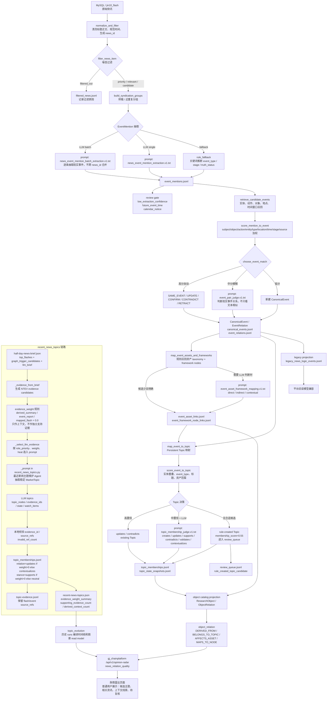

# News Processing Flowchart

本文把当前新闻处理链路、主要算法和提示词入口整理成一张流程图，便于前端、后端和内容 QA 对齐展示边界。

## 总览

## 当前关键算法

| 阶段 | 算法 / 规则 | 作用 |
| --- | --- | --- |
| 新闻标准化 | `stable_news_id(source_system, row_id, publish_time, content_hash)` | 让同一条新闻 ID 稳定 |
| 过滤 | `filter_news_item()` + 资产 taxonomy | 去广告、过滤纯价格 tick、保留重要/有信号新闻 |
| 转载分组 | `build_syndication_groups()` | 防止转载被误认为独立来源 |
| Mention 抽取 | LLM prompt + rule fallback | 把一条新闻拆成一个或多个 `EventMention` |
| 事件召回 | `retrieve_candidate_events()` | 从已有 `CanonicalEvent` 中找候选 |
| 事件打分 | `score_mention_to_event()` | subject/object/action/entity/type/location/time/stage/source 加权 |
| 事件裁决 | 阈值自动 + `event_pair_judge` LLM | 判断 `SAME_EVENT`、`UPDATE`、`CONTRADICT` 等关系 |
| 资产映射 | taxonomy 召回 + framework node 召回 + 可选 LLM | 生成 `AFFECTS_ASSET`、`MAPS_TO_NODE` |
| Topic 映射 | `score_event_to_topic()` + 可选 `topic_membership_judge` | 生成 `BELONGS_TO_TOPIC` / `TopicMembership` |
| Review gate | 低置信、未来时间、日历提醒、规则新建 Topic | 防止候选被误展示为高置信事实 |
| 主题抽取 | `recent_news_topics._prompt()` | 从半日新闻 signals 抽稳定 MarketTopic |
| 证据权重 | `evidence_weight=0` 上下文，`>0` 才是支持证据 | 防止半日简报 / 派生报告污染证据链 |
| 平台展示 | `news_relation_quality` | 给普通用户展示候选态质量概览 |

## 当前提示词入口

| 提示词 | 文件 / 函数 | 用途 |
| --- | --- | --- |
| EventMention batch 抽取 | `quanta_agents/prompts/news_event_mention_batch_extraction.v1.txt` | 逐条新闻抽取现实事件；不补外部事实；不把预测当事实 |
| EventMention single 抽取 | `quanta_agents/prompts/news_event_mention_extraction.v1.txt` | 单条新闻抽取；与 batch 规则一致 |
| EventPair 裁决 | `quanta_agents/prompts/event_pair_judge.v1.txt` | 判断新 mention 与已有 event 的现实关系 |
| 资产 / 框架节点映射 | `quanta_agents/prompts/event_asset_framework_mapping.v1.txt` | 判断 direct / indirect / contextual 资产影响 |
| Topic membership 裁决 | `quanta_agents/prompts/topic_membership_judge.v1.txt` | 判断 creates / updates / supports / contradicts / validates / contextualizes |
| 最近新闻主题抽取 | `quanta_agents/market_themes/recent_news_topics.py::_prompt()` | 从 signals 抽持续维护的 MarketTopic |
| Topic merge | `quanta_agents/market_themes/recent_news_topics.py::_merge_prompt()` | 多 batch topic 合并 |

## 展示边界

- `EventMention` 和 `CanonicalEvent` 默认是候选，不是已确认事实。
- `event_report`、`derived_summary`、半日简报包装层默认 `evidence_weight=0.0`，只能展示为“上下文线索”。
- 只有 `evidence_weight > 0` 的对象才能计入 `supporting_evidence_count`。
- `review_queue_count > 0` 时，页面应提示“待复核”，不要展示为正式结论。
- Topic 名称应尽量中性稳定；情绪化短标题只能作为展示别名或状态说明。

