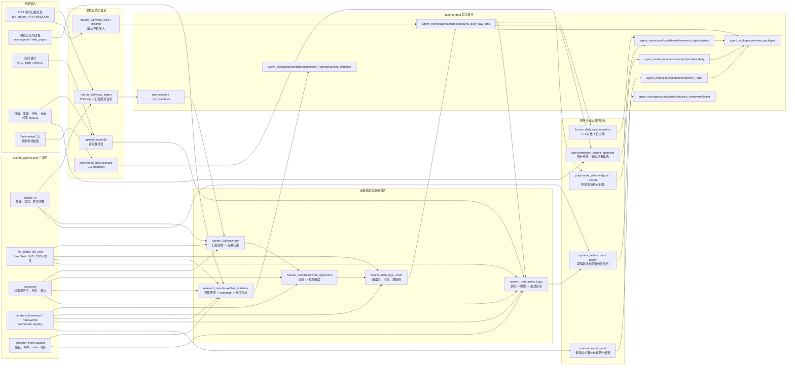
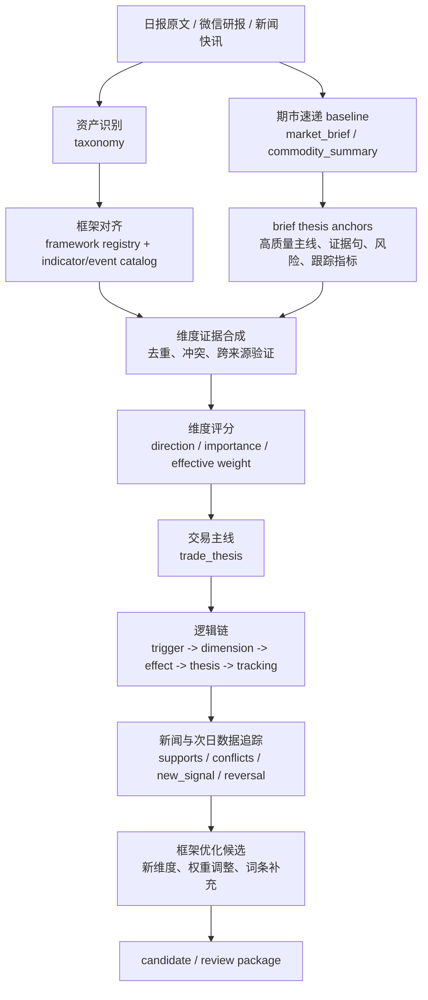

# Quanta Agents 架构图

本文只描述 `quanta_agents` 项目内部的 Agent 运行体系。前端页面、登录权限、审核 UI 属于 `gj_chainplatform`；长期事实源、候选区和 gold 属于 `quanta_data`。

## 总览



## 当前主链路



这条链路的核心是：研报不直接变成结论，而是先拆成证据；新闻不是单独做热点，而是对已有逻辑链做时间线验证；数据库不是噪音行情，而是用于验证框架维度和 claim 的结构化证据。

## 期市速递与动态逻辑链的分工

当前版本中，固定工作流生成的期市速递在叙事质量、主次取舍和可读性上优于动态生成的期市逻辑链。因此短期内：

- `market_brief` / 期市速递继续作为人类主展示和日报质量基准。
- `logic_chain` 不直接替代期市速递，而是作为实时新闻、研报增量、行情/基本面验证和 Polymarket 事件进入后的动态骨架。
- 动态逻辑链必须输出 `brief_logic_benchmark_map`，说明每条动态主线继承了哪条期市速递主线、新增了哪些 signal、出现了哪些冲突。
- 平台展示时先展示期市速递结论，再把动态逻辑链作为“新增证据、冲突、验证和跟踪”层叠加。
- `brief_thesis_anchor`、`brief_logic_benchmark_map`、`research_signal` 和 `theme_anchor` 的 schema 源头在 `quanta_data/configs/schemas`；本仓新增生成器必须按这些 schema 校验。

这能保留当前成品质量，同时为后续实时信息源处理留下可计算结构。详细方案见：[signal-integration-and-framework-optimization-plan.md](signal-integration-and-framework-optimization-plan.md)。

## 模块职责

| 层 | 模块 | 职责 | 主要输出 |
| --- | --- | --- | --- |
| 共享层 | `quanta_agents.core.config/io` | 读取 `.env`、解析 `GJ_QUANTA_DATA_ROOT`、统一 JSON 写入 | 所有 Agent 共用 |
| 共享层 | `core.llm_client/llm_json` | DeepSeek、MiniMax M3 调用，JSON 修复与 fallback | LLM structured output |
| 共享层 | `core.taxonomy` | 读取标准资产名、别名、板块和宏观桶 | asset normalization |
| 共享层 | `core.analysis_framework/frameworks` | 生成/读取框架注册表和指标事件目录 | registry、catalog |
| 期市日报 | `futures_daily.raw_ingest` | 从 OSS 拉取日报原文 zip 并落 raw | raw object、manifest |
| 期市日报 | `futures_daily.raw_run` | 从日报原文抽取每个品种的因素和市场摘要 | summary、market_review |
| 期市日报 | `futures_daily.framework_alignment` | 把因素映射到品种 framework 维度 | framework_alignment、factor_clusters |
| 期市日报 | `futures_daily.logic_chain` | 维度打分、证据合并、主线判断、逻辑链 | dimension_scores、trade_thesis、logic_chains |
| 期市日报 | `futures_daily.logic_evolution` | 比较两天日报逻辑，判断延续、验证、弱化、反转 | logic evolution candidate |
| 研报证据 | `research_reports.wechat_evidence` | 将公众号研报逐篇拆 evidence，合成品种/维度结论 | wechat-research-evidence |
| 舆情雷达 | `opinion_radar.news_logic` | 新闻映射到框架维度并对比研报主线 | news_logic radar |
| 舆情雷达 | `opinion_radar.export/report` | 主题热度、新闻逻辑雷达、市场报告导出 | radar.json、market-radar-report |
| 预测市场 | `polymarket_daily.collector/analysis/export` | 预测市场热点采样、分析和日报候选 | hotspots、daily_report |
| 框架优化 | `core.framework_audit` | 审计历史 framework 格式和缺口 | framework audit candidate |
| 框架优化 | `core.framework_weight_optimizer` | 用历史经验和动态结果生成权重调整候选 | framework-weight-optimization |
| 知识维护 | `maintenance.*`（规划） | 扫描 schema、证据、候选、review package、wiki 和框架健康状态 | knowledge_maintenance candidate |

## 关键产物关系

```text
agent_workspace/candidates/futures_daily_raw_runs/{yyyy}/{mm}/{dd}/RUN-.../
  manifest.json
  YYYYMMDD_commodity_summary.json
  YYYYMMDD_commodity_marketreview.json
  framework_alignment.json
  dimension_scores.json
  trade_thesis.json
  logic_chains.json
  framework_update_candidates.json
  framework_format_review.json

agent_workspace/candidates/research_reports/wechat_evidence/latest/wechat-research-evidence.json
agent_workspace/candidates/opinion_radar/news_logic/latest/news-logic.json
agent_workspace/candidates/opinion_radar/reports/latest/market-radar-report.json
agent_workspace/candidates/framework_optimization/latest/framework-weight-optimization.json
agent_workspace/candidates/analysis_framework/latest/analysis-framework-registry.json
agent_workspace/candidates/analysis_framework/latest/indicator-event-catalog.json
```

## CLI 入口

| CLI | 对应模块 | 用途 |
| --- | --- | --- |
| `quanta-futures-daily-raw-ingest` | `futures_daily.raw_ingest` | 拉取日报原文 zip |
| `quanta-futures-daily-run-raw` | `futures_daily.raw_run` | 从日报原文生成全套日频逻辑链产物 |
| `quanta-futures-daily-align` | `futures_daily.framework_alignment` | 对已有 summary 单独重算框架映射 |
| `quanta-futures-daily-logic-chain` | `futures_daily.logic_chain` | 对已有 summary/alignment 重算主线和逻辑链 |
| `quanta-futures-daily-logic-evolution` | `futures_daily.logic_evolution` | 比较两期 run 的逻辑演化 |
| `quanta-wechat-research-evidence` | `research_reports.wechat_evidence` | 生成微信研报证据池和 LLM 主线更新 |
| `quanta-opinion-radar-news-logic` | `opinion_radar.news_logic` | 单独生成新闻逻辑雷达 |
| `quanta-opinion-radar-export` | `opinion_radar.export` | 导出舆情雷达、新闻逻辑引用和报告 |
| `quanta-framework-audit` | `core.framework_audit` | 审计框架格式和历史遗留问题 |
| `quanta-framework-weight-optimize` | `core.framework_weight_optimizer` | 生成动态权重优化候选 |
| `quanta-analysis-framework-registry` | `core.analysis_framework` | 生成 framework registry 和指标事件目录 |
| `quanta-polymarket-daily` | `polymarket_daily.export` | 生成预测市场热点日报候选 |

## 设计边界

- `quanta_agents` 只写 `candidate`、`run`、`review_package`、raw/canonical/evidence 相关产物，不直接改 `gold/active`。
- 标准资产名、framework 维度、指标/事件词条来自知识库文件，不写死在代码或 prompt 里。
- LLM 用在抽取、合并、映射、主线总结和权重复核上；规则层只负责兜底、校验、去重和格式化。
- 新闻、研报、数据库最终要落到同一套 `asset -> dimension -> evidence -> thesis -> timeline` 结构上。
- 第二天日报和后续新闻/数据用于验证前一天主线，输出优化候选，而不是自动覆盖长期框架。

## 知识库维护 Agent

维护 Agent 是运行层的健康巡检者，不是 gold writer。它读取 `quanta_data` 的 schema、状态机、候选、review package、evidence 和 indexes，输出 `agent_workspace/candidates/knowledge_maintenance`。

首批检查：

- candidate/review package schema 和路径合法性。
- machine_published 是否带 evidence refs、run refs 和过期策略。
- 当日候选是否被 review package 覆盖。
- raw/canonical/evidence 数量是否明显失衡。
- framework optimization 是否影响 active 框架但缺人工审核。
- LLM wiki 或派生索引是否落后于源 evidence/gold。

运行细节见：[knowledge-maintenance-agent-runbook.md](knowledge-maintenance-agent-runbook.md)。
