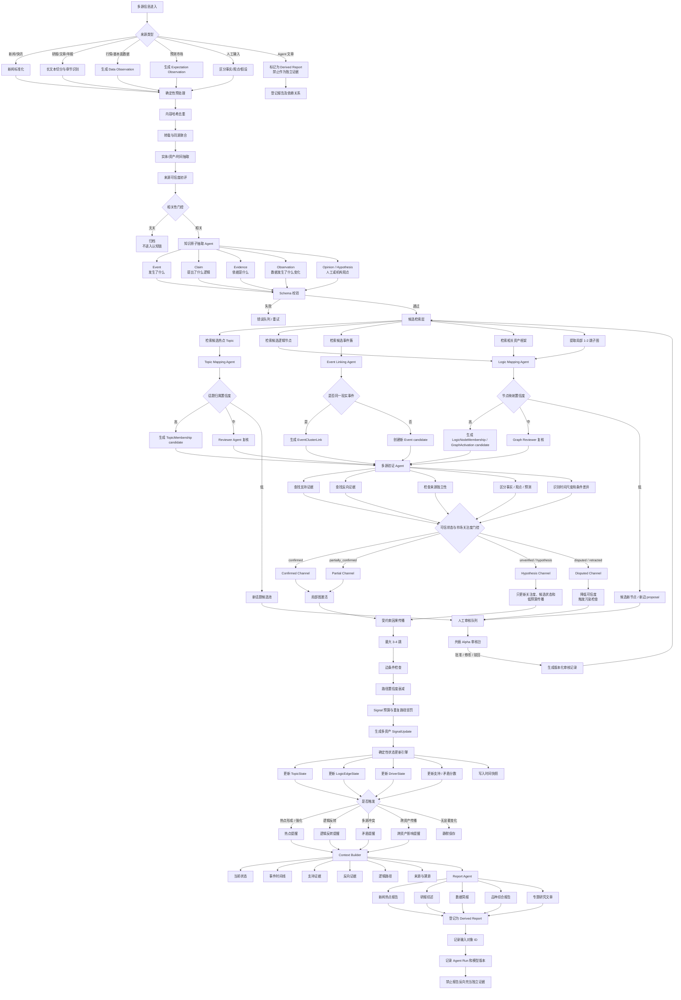

# Quanta Cognitive LangGraph Flow

本文定义 Quanta 后续多源认知处理链的运行编排口径。它补充：

- [quanta-knowledge-storage-layout.md](quanta-knowledge-storage-layout.md)：长期知识对象和存储布局。
- [asset-driver-cognition-system.md](asset-driver-cognition-system.md)：资产事件状态机和事件溯源原则。
- [asset-driver-cognition-data-flow.md](asset-driver-cognition-data-flow.md)：Event / Graph / Signal / Driver 的资产驱动链路。

核心原则：

```text
Agent 提出语义判断
确定性算法执行去重、计分、传播和状态更新
统一写入服务控制生产数据
报告只作为可重建的派生产物
```

LangGraph 适合负责编排和条件分支，不应成为真源写入层。所有高影响对象都必须通过 schema 校验、review gate 和 `Knowledge Write Service` 后，才能进入稳定状态。

## System Shape

建议把完整链路拆成五类运行服务：

| 服务 | 角色 | 产物 |
| --- | --- | --- |
| Ingestion Service | 多源输入标准化、原文落地、基础元数据抽取 | `Document`、`DocumentChunk`、`Observation`、raw manifest |
| Cognitive Extraction Graph | 用 Agent 从文档和数据中抽取知识原子 | `Event`、`Claim`、`Evidence`、`Observation`、`HumanClaim` candidate |
| Mapping Graph | 用候选召回 + Agent 判断建立局部关系 | `TopicMembership`、`LogicNodeMembership`、`EventClusterLink`、`GraphActivation` candidate |
| Validation And Propagation Engine | 多源验证、可信状态门控、受约束因果传播 | `ValidationState`、`CausalPath`、`SignalUpdate` |
| State And Report Layer | 确定性状态更新、触发提醒、构建报告上下文 | `TopicState`、`LogicEdgeState`、`DriverStateSnapshot`、`DerivedReport`、`ReportDependency` |

最小闭环可以先做：

```text
半日新闻简报
  -> Event / EventReport
  -> TopicMembership
  -> TopicState
  -> Topic timeline / graph page
  -> DerivedReport
```

之后再接入研报 `Claim / Evidence`、数据 `Observation`、逻辑节点和 `DriverState`。

## Mermaid Flow



## LangGraph State Contract

LangGraph 的共享状态不应保存完整原文，只保存对象 ID、候选包和校验结果：

```json
{
  "run_id": "RUN-...",
  "input_refs": [],
  "documents": [],
  "knowledge_atom_candidates": [],
  "mapping_candidates": [],
  "validation_results": [],
  "propagation_candidates": [],
  "state_update_candidates": [],
  "report_contexts": [],
  "errors": [],
  "review_required": []
}
```

每个节点输出必须满足：

- 可追溯到 `input_ref`、`source_document_id` 或 `object_id`。
- 保留 `agent_run_id`、`prompt_version`、`model_version`。
- 不直接覆盖 `TopicState`、`DriverState` 或正式 `GraphEdge`。
- 失败进入错误队列，不能悄悄降级为无来源结论。

## Agent Responsibilities

| Agent | 主要职责 | 不应负责 |
| --- | --- | --- |
| Knowledge Extraction Agent | 抽取 Event、Claim、Evidence、条件和时间尺度 | 直接修改状态权重 |
| Topic Mapping Agent | 从候选话题中选择归属，识别新话题候选 | 遍历全部历史话题，直接修改 Topic |
| Logic Mapping Agent | 映射已有逻辑节点，识别跨资产共享节点 | 自由创建正式节点或正式边 |
| Event Linking Agent | 判断同一事件、更新、确认或反驳关系 | 仅凭 embedding 合并事件 |
| Validation Agent | 找支持证据、反向证据、来源依赖和时间条件差异 | 简单多数投票 |
| Graph Reviewer Agent | 复核新节点、新边、长路径和低置信结果 | 自动批准高影响拓扑变更 |
| Report Agent | 基于 Context Package 写报告 | 直接从原始知识库自由漫游或生成新证据 |

Agent 负责语义判断，输出 candidate、reason 和 source refs。状态计算、阈值、图传播预算和写入由确定性服务处理。

## Deterministic Services

确定性服务负责：

- 文档哈希与幂等 ID。
- 转载识别和同源聚合。
- 候选检索。
- 评分、阈值和时间衰减。
- 来源独立性惩罚。
- 图传播深度限制。
- Signal 预算和重复路径惩罚。
- `TopicState`、`LogicEdgeState`、`DriverState` 更新。
- 数据库或文件写入。
- 版本、回放和溯源。

建议把生产写入收敛到一个 `Knowledge Write Service`：

```text
candidate object
  -> schema validation
  -> idempotency check
  -> provenance check
  -> review policy
  -> append log / versioned write
  -> read model projection
```

LangGraph 节点只调用写入服务，不直接写 `gold`、正式 state 或正式 graph edge。

## Credibility And Attention

可信状态和市场关注度必须分开：

```json
{
  "truth_status": "unverified | partially_confirmed | confirmed | disputed | retracted",
  "market_attention": 0.0,
  "credibility_score": 0.0,
  "source_diversity": 0.0,
  "contradiction_score": 0.0
}
```

处理原则：

- 新闻和传闻可以提高 `market_attention`、topic heat 和 watch signal。
- 未验证信息只能进入低预算传播，不能直接强化 driver confidence。
- 研报观点是 `Claim`，不是事实。
- Polymarket 是 `ExpectationObservation`，不是事实概率。
- Agent 报告是 `DerivedReport`，默认 `evidence_weight=0`。
- 被反驳或撤回的信息必须触发污染检查，检查之前是否已经影响 topic、logic edge 或 driver state。

## Data Locations

目标写入位置归 `quanta_data`，当前可先落在 `agent_workspace/candidates` 做候选：

```text
quanta_data/
  raw_objects/
  raw_manifests/

  canonical_objects/
    documents/
    document_chunks/
    events/
    claims/
    evidence/
    observations/
    market_topics/
    logic_graph/

  relations/
    topic_memberships/
    logic_node_memberships/
    event_cluster_links/
    report_dependencies/

  event_logs/
    market_topics/
    graph/
    drivers/
    reviews/

  states/
    market_topics/
    logic_edges/
    drivers/

  snapshots/
    market_topics/
    graphs/
    drivers/

  agent_runs/
  review_logs/
  wiki_projection/
```

`agent_workspace/candidates/market_topics/latest/topic-memberships.jsonl` 是现阶段 `TopicMembership` 的候选读写入口；未来晋级后应迁到 `relations/topic_memberships/...`。

## Review Policy

必须进入审核队列的情况：

- 新建正式 topic、logic node 或 logic edge。
- topic merge / split。
- edge polarity、edge weight 或 delay 变化。
- 低置信但高影响的跨资产传播。
- disputed / retracted 信息已经影响状态。
- Agent 输出引用失效、source refs 不足或证据链断裂。

可自动写入 candidate 的情况：

- 已有 topic 的低风险 membership candidate。
- 已有 node 的 graph activation candidate。
- 只影响 heat / attention 的 unverified watch signal。
- 无显著状态变化的静默快照。

## Rollout Plan

第一阶段：新闻主题闭环。

- 以半日新闻简报和小时新闻简报为输入。
- 抽取 Event / EventReport。
- 生成 `TopicMembership` candidate。
- 更新 `TopicState` candidate。
- 在 Alpha 页面展示 topic timeline 和 source refs。
- 生成 DerivedReport，并写 `ReportDependency`。

第二阶段：研报 Claim / Evidence。

- 把结构化研报 profile 和 evidence bridge 拆成 Claim / Evidence。
- 对齐到 Topic、LogicNode 和资产框架。
- 加入支持 / 反向证据和来源独立性检查。

第三阶段：数据 Observation。

- 把基本面、行情、持仓、仓单和 Polymarket 统一成 Observation。
- 用 Observation 验证 Claim 和 TopicState。
- 区分事实、预期和市场反应。

第四阶段：受约束因果传播。

- 从局部 1-2 跳子图开始。
- 增加最大 3-4 跳传播、路径衰减、信号预算和重复路径惩罚。
- 只允许通过 SignalUpdate 更新 DriverState。

第五阶段：审核与晋级。

- 在共振 Alpha 审核台处理新 topic、新 node、新 edge、冲突和污染检查。
- 审核结果写 `ReviewLog`。
- 晋级对象从 candidate 进入 canonical / relations / states / event_logs。
