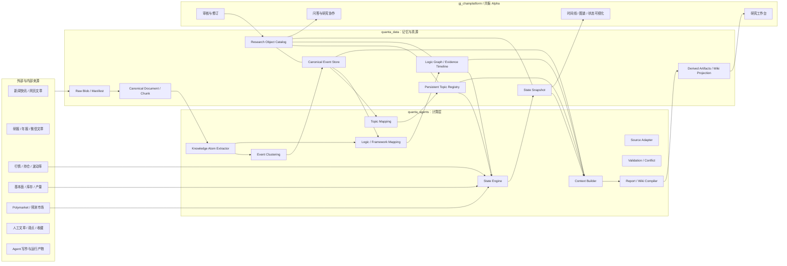

# Quanta Research Knowledge Fabric 架构设计

- **版本**：v1.1
- **状态**：Architecture Design Candidate
- **日期**：2026-06-22
- **适用项目**：
  - `quanta_data`：Research Memory、数据资产、对象目录、图谱与状态真源
  - `quanta_agents`：采集、抽取、映射、聚类、状态计算、报告与 Wiki 编译
  - `gj_chainplatform` / 共振 Alpha：查询、审核、协作、可视化与人机交互
- **主要读者**：产品负责人、投研负责人、后端工程师、Agent 工程师、数据工程师

相关文档：

- [quanta-agents-architecture.md](quanta-agents-architecture.md)：`quanta_agents` 当前运行体系、CLI 和候选产物。
- [research-object-relation-architecture.md](research-object-relation-architecture.md)：不同来源先转换为知识对象，再通过共享锚点和显式关系汇合的工程架构。
- [quanta-knowledge-storage-layout.md](quanta-knowledge-storage-layout.md)：`quanta_data` 长期目录、状态、Wiki 投影和检索顺序。
- [quanta-cognitive-langgraph-flow.md](quanta-cognitive-langgraph-flow.md)：LangGraph 编排、Agent 职责与写入门控。
- [asset-event-state-machine.md](asset-event-state-machine.md)：资产事件和 Driver State 的局部状态机。
- [logic-graph-optimizer.md](logic-graph-optimizer.md)：逻辑图谱优化、候选晋级和回滚思路。

---

## 1. 文档目的

本文件定义 Quanta 从多源数据接入，到事件归并、持续 Topic 维护、逻辑图谱构建、跨资产传播、Driver State 更新、检索问答、报告和 Wiki 生成的端到端架构。

它解决的问题不是“再增加一个日报工作流”，而是让新闻、研报、年报、行情、基本面、预测市场、人工观点和 Agent 产物进入同一套可追溯、可回放、可审核的研究知识织网。

本文件用于指导：

- 新 schema、目录、索引和状态机设计。
- `quanta_agents` 新增 pipeline、service、repository 和 Agent 工具接口。
- `gj_chainplatform` 对 Topic、事件、逻辑路径和 Driver State 的读取与审核。
- 跨 repo 实施时的 `dev_work_order.v1` 拆解、验收和回归检查。

## 2. 核心结论

Quanta 应从“多条按数据源组织的日报和雷达流程”演进为以研究对象、关系和状态为中心的 **Research Knowledge Fabric**。

核心链路：

```text
多源原始数据
  -> 标准文档与数据记录
  -> Knowledge Atom
  -> Canonical Event
  -> Persistent Topic
  -> Logic Graph / Asset Framework View
  -> Signal Update
  -> Driver State
  -> Context Package
  -> 报告、问答、Wiki、预警和审核界面
```

关键原则：

- 文件是内容载体，不承担核心语义。
- 一个现实事件只保存一次，资产、Topic、逻辑节点通过关系连接。
- Topic 是长期动态对象，不是每天重新生成的报告标题。
- 基础逻辑结构、证据时间线和当前激活状态必须分离。
- Agent 负责语义抽取、候选判断和叙事生成，普通代码负责 ID、事务、去重、评分、状态和持久化。
- 新闻、研报、预测市场、人工观点和 Agent 报告必须保留各自认知角色，不能混成同一种事实证据。
- `quanta_data` 是 source of truth，SQLite、搜索索引、Neo4j 和 Wiki 都是可重建投影或 sidecar。
- 写入时做增量计算，查询时优先读取物化状态，避免每次问答全图重算。

## 3. 当前基线与缺口

当前项目已经具备这些基础：

- `raw`、`canonical`、`evidence`、`candidate`、`review`、`gold` 分层。
- 资产 taxonomy、framework registry 和 indicator/event catalog。
- 期市速递、动态逻辑链、逻辑演化和品种数据简报。
- 微信研报画像与 evidence 抽取。
- 新闻舆情雷达、framework node 映射和半日新闻简报。
- Polymarket 热点和 `research_signal.v1` / `theme_anchor.v1`。
- `ResearchObject`、`CanonicalEvent`、`Topic`、`TopicMembership`、`ReportDependency` 和 SQLite `CatalogRepository` 雏形。
- run manifest、source refs、review package 和 schema 校验。

主要结构缺口：

- Pipeline 仍按数据源组织，新闻、研报、Polymarket、基本面各自形成局部语义。
- 同一现实新闻影响多个资产时，仍容易产生多个资产级事件。
- `theme_anchor` 更像近期候选，不是稳定 Persistent Topic Registry。
- 对象关联仍大量依赖目录、`latest` 文件、路径扫描和局部字段。
- Topic 命名、匹配和合并仍容易依赖关键词与硬编码。
- 缺少统一的 `object_id`、关系表、provenance 查询和状态回放接口。
- Topic、Logic Edge 和 Driver 的当前状态尚未完全进入统一时间模型。
- Agent 派生报告未来可能被误当成独立证据，造成自我强化污染。

## 4. 项目职责边界

### 4.1 quanta_data：记忆与真源

`quanta_data` 负责保存：

- 原始文件、manifest、标准文档和 chunk。
- Research Object Catalog、对象版本和对象关系。
- Canonical Event、Event Mention、Claim、Evidence、Observation。
- Persistent Topic、Topic Membership、Topic State 和 Topic Change Log。
- Logic Node、Logic Edge、Evidence Timeline、Edge State。
- Signal Update、Driver State Snapshot、Conflict Set。
- Derived Report、Wiki Projection、Agent Run、Report Dependency。
- candidate、review package、gold、schema、policy 和 prompt 版本引用。

`quanta_data` 不负责调用 LLM、自主生成结论、绕过 review gate 修改正式知识，或承载页面交互。

### 4.2 quanta_agents：认知计算与维护层

`quanta_agents` 负责：

- Source Adapter、Raw / Canonical 标准化和知识原子抽取。
- 新闻去重、转载识别、Event Mention 抽取和 Canonical Event 归并。
- Topic 候选召回、Topic Mapping、Topic State 更新。
- 研报 Claim 抽取、Logic Node 映射和候选 Logic Edge 生成。
- 跨资产局部因果传播、Signal Update 和 Driver State 计算。
- 多源验证、冲突检测、Context Package 生成。
- 日报、专题报告、Wiki 页面和 Alpha 读模型编译。
- 维护扫描、benchmark、候选优化和 review package 生成。

`quanta_agents` 不负责用户权限、正式知识人工审批、Active Gold Promotion，也不得让 LLM 直接控制数据库事务。

### 4.3 gj_chainplatform / 共振 Alpha：交互与审核层

平台负责：

- 查看 Topic、Canonical Event、证据链、逻辑路径和 Driver State。
- 查看支持证据、反向证据、真假状态、来源独立性和派生依赖。
- 人工确认、驳回、合并、拆分、修订和审核。
- 研究问答、协作、报告展示和认知可视化。
- 展示事件时间线、逻辑图谱、状态曲线和 review queue。

平台不应把 UI 修订直接写成 active truth。所有高影响变更必须形成结构化 candidate 或 review action。

## 5. 总体系统上下文



## 6. 分层模型

| 层级 | 名称 | 主要对象 | 说明 |
| --- | --- | --- | --- |
| L0 | Source Layer | 新闻、研报、行情、基本面、预测市场、人工观点、Agent 产物 | 来源只表示 provenance，不等于认知角色 |
| L1 | Raw / Canonical Layer | `RawObject`、`RawManifest`、`CanonicalDocument`、`DocumentChunk` | 原文只保存一次，chunk 能回到页码、段落、表格和 offset |
| L2 | Knowledge Atom Layer | `EventMention`、`Claim`、`Evidence`、`Observation`、`HumanOpinion` | 最小可计算知识单元 |
| L3 | Catalog / Relation Layer | `ResearchObject`、`ObjectRelation`、`AgentRun`、`ReportDependency` | 统一 ID、版本、时间、关系和 provenance |
| L4 | Semantic Structure Layer | `CanonicalEvent`、`Topic`、`LogicNode`、`LogicEdge`、`AssetFrameworkView` | 稳定语义对象和长期结构 |
| L5 | Dynamic State Layer | `EventState`、`TopicState`、`LogicEdgeState`、`SignalUpdate`、`DriverStateSnapshot`、`ConflictSet` | 可回放、可解释的时间状态 |
| L6 | Retrieval / Context Layer | `ContextPackage`、Timeline、Local Graph、Evidence Pack | 给 Agent 和 Alpha 查询使用 |
| L7 | Derived Artifact Layer | 日报、专题报告、Wiki 页面、问答草稿、预警 | 派生产物，默认不能作为独立证据 |

## 7. 统一 Research Object

所有长期对象共享一个基础外壳：

```json
{
  "object_id": "OBJ-...",
  "object_type": "document|chunk|event_mention|canonical_event|claim|evidence|observation|topic|logic_node|logic_edge|signal|state_snapshot|report|agent_run",
  "title": "string",
  "content_uri": "quanta://...",
  "content_hash": "sha256:...",
  "source_type": "news|research_report|annual_report|market_data|fundamental_data|polymarket|human|agent",
  "source_id": "string",
  "published_at": "ISO8601|null",
  "event_time": "ISO8601|null",
  "recorded_at": "ISO8601",
  "effective_from": "ISO8601|null",
  "effective_to": "ISO8601|null",
  "truth_status": "unverified|partially_confirmed|confirmed|disputed|retracted|not_applicable",
  "lifecycle_status": "candidate|active|archived|superseded|rejected",
  "schema_version": "research_object.v1",
  "metadata": {}
}
```

时间字段必须区分：

- `published_at`：来源发布日期。
- `event_time`：现实事件发生时间。
- `recorded_at`：系统知道该信息的时间。
- `effective_from`：逻辑或影响开始生效的时间。
- `effective_to`：逻辑或影响结束时间。
- `as_of`：状态快照的观察时点。

## 8. 统一关系模型

关系本身是一等对象，不应只藏在对象字段里：

```json
{
  "relation_id": "REL-...",
  "from_object_id": "OBJ-A",
  "relation_type": "DERIVED_FROM",
  "to_object_id": "OBJ-B",
  "polarity": 1,
  "confidence": 0.84,
  "effective_from": "ISO8601|null",
  "effective_to": null,
  "evidence_object_id": "EVIDENCE-...",
  "agent_run_id": "RUN-...",
  "status": "candidate|active|rejected"
}
```

核心关系类型：

| 关系 | 含义 |
| --- | --- |
| `DERIVED_FROM` | 对象由另一对象抽取或加工而来 |
| `GENERATED_FROM` | 报告、状态或 Wiki 页面由输入集合生成 |
| `SAME_EVENT_AS` | 两个 Mention 表达同一现实事件 |
| `UPDATES` | 对已有事件的新进展 |
| `CONFIRMS` | 对事件、主张或逻辑的确认 |
| `CONTRADICTS` | 与事件、主张或逻辑矛盾 |
| `RETRACTS` | 撤回或否认 |
| `BELONGS_TO_TOPIC` | 对象属于某 Topic |
| `SUPPORTS` | 支持 Claim、Logic Edge 或 Driver |
| `VALIDATES` | 数据或事实验证某逻辑 |
| `MAPS_TO_NODE` | 概念映射到 Logic Node |
| `ACTIVATES` | Event 激活 Logic Node |
| `AFFECTS_ASSET` | Event 或路径影响资产 |
| `SUPERSEDES` | 新版本替代旧版本 |
| `GENERATED_BY` | 由 Agent Run 生成 |

## 9. 多源认知角色

不同来源进入系统后不能被当成同一种证据：

| 来源 | 主要转化对象 | 默认认知角色 |
| --- | --- | --- |
| 新闻快讯 | `EventMention`、`CanonicalEvent` | 描述发生了什么，可能未验证 |
| 研报、年报 | `Claim`、`Evidence` | 提出逻辑主张和论据 |
| 行情数据 | `MarketObservation` | 观测市场反应 |
| 基本面数据 | `FundamentalObservation` | 验证供需、库存、成本等逻辑 |
| Polymarket | `ExpectationObservation` | 表示预期，不代表事实 |
| 人工观点 | `HumanClaim`、`ResearchNote` | 人的判断、假设或复核意见 |
| Agent 报告 | `DerivedReport` | 派生结果，默认 evidence weight 为 0 |

必须保留两条正交维度：

```text
truth_status：信息是否真实、是否被确认
market_attention：市场是否正在交易这条消息
```

未确认传闻可以有高 `market_attention`，但不能直接进入 confirmed fundamental state。

## 10. 新闻微批与 Canonical Event

新闻处理采用：

```text
实时预处理
+ 5 到 10 分钟微批
+ 小时级状态更新
+ 日终 Topic 整理
```

实时处理负责保存原文、URL 标准化、内容哈希、来源识别、时间解析、基础实体识别、低成本过滤和 buffer 入队。

微批处理负责：

```text
Raw News Item
  -> Syndication Group
  -> Event Mention
  -> Candidate Event Retrieval
  -> Structured Matching Score
  -> LLM Event Pair Judge when needed
  -> Canonical Event / EventRelation
  -> Topic Mapping
  -> Logic Node Activation
  -> State Update
```

`EventMention` 示例：

```json
{
  "mention_id": "MENTION-...",
  "source_news_id": "NEWS-...",
  "subject": ["伊朗"],
  "action": "否认",
  "object": ["封锁霍尔木兹海峡"],
  "location": ["霍尔木兹海峡"],
  "event_type": "shipping_disruption",
  "event_stage": "denial",
  "modality": "official_statement",
  "event_time": "2026-06-21T10:00:00+08:00",
  "entities": ["伊朗", "霍尔木兹海峡"],
  "canonical_summary": "伊朗否认将封锁霍尔木兹海峡",
  "truth_status": "partially_confirmed",
  "extraction_confidence": 0.91,
  "evidence_quote": "..."
}
```

事件阶段必须区分：可能发生、已经发生、官方宣布、市场传闻、否认、撤回、恢复、完成。

### 10.1 转载和来源独立性

同一原始报道的转载进入 `SyndicationGroup`：

```text
30 条媒体转载
  -> 30 个 Raw News Item
  -> 若干 Event Mention
  -> 1 个 Syndication Group
  -> 独立来源数不因此变成 30
```

判断依据包括 canonical URL、内容哈希、标题近重复、正文 n-gram、发布时间、引用来源和“据某社”关系。

每个 Evidence 应保留：

```text
root_source_id
source_group_id
syndication_group_id
independence_factor
```

### 10.2 Event Matching

新 Mention 不与所有历史事件比较，只召回 10 到 20 个候选：

```text
相同或相关核心实体
+ 相同或相近 event_type
+ 相近地点
+ 相近时间窗口
+ 相似 action / object
+ BM25 / embedding Top-K
```

建议窗口：

- 普通事件：3 到 7 天。
- 持续事件：30 到 90 天。

初始结构化评分：

```text
EventMatchScore =
0.22 * subject_object_match
+ 0.18 * action_match
+ 0.15 * entity_overlap
+ 0.10 * event_type_match
+ 0.10 * location_match
+ 0.10 * time_proximity
+ 0.08 * semantic_similarity
+ 0.04 * stage_compatibility
+ 0.03 * source_reference_match
```

门控：

- `score >= 0.86`：自动 `SAME_EVENT`。
- `0.65 <= score < 0.86`：进入 LLM Event Pair Judge。
- `score < 0.65`：创建新 Canonical Event。

“封锁传闻”和“官方否认封锁”不能简单合并，应创建两个 Event，并用 `CONTRADICTS` 连接。

### 10.3 防止链式过合并

事件簇必须保存 cluster signature、核心实体、核心 action / object、event stage、时间范围、代表性 exemplars、must-not-link 约束和首次原始证据。

新 Mention 只有满足以下条件才能自动并入：

```text
与 prototype 相似
且与至少一个 exemplar 相似
且不违反 must-not-link
且阶段兼容
```

## 11. Persistent Topic

Topic 表示持续演化的市场主题，而不是单条现实事件、一次日报标题或一个临时文件夹。

```json
{
  "topic_id": "TOPIC-HORMUZ-RISK",
  "canonical_title": "霍尔木兹航运与能源供应风险",
  "topic_type": "market_theme",
  "definition": "围绕霍尔木兹海峡通航、油轮安全及其对能源供应影响形成的持续市场主题。",
  "core_entities": ["霍尔木兹海峡", "伊朗", "油轮"],
  "core_event_types": ["shipping_disruption", "geopolitics", "oil_supply"],
  "core_logic_nodes": [
    "global.shipping_disruption",
    "global.energy_supply_risk",
    "global.energy_price"
  ],
  "included_scope": ["通航状态", "航运暂停", "保险费用", "军事威胁"],
  "excluded_scope": ["与霍尔木兹无关的普通中东外交新闻"],
  "first_seen_at": "ISO8601",
  "last_active_at": "ISO8601",
  "lifecycle_state": "strengthening",
  "heat_score": 0.82,
  "credibility_score": 0.61,
  "source_diversity": 0.73,
  "contradiction_score": 0.29,
  "status": "active",
  "version": 7
}
```

Topic 生命周期：

```text
candidate -> emerging -> active -> strengthening -> mature -> fading -> archived
```

允许补充分支：

```text
fading -> reactivated
active -> disputed
```

Topic 命名规则：

- 使用中性名词短语。
- 8 到 20 个中文字符为宜。
- 不写利多、利空、热点、主线、变化。
- 方向、强弱和时间状态另存。

示例：

```text
推荐：霍尔木兹航运风险、铜精矿供应约束、美国货币政策再定价
不推荐：原油利多主线、供应变化热点、库存下降影响铜价
```

### 11.1 Topic Membership

归类关系单独存储，不只在 Event / Claim / Evidence 上写 `topic_id`：

```json
{
  "membership_id": "MEM-...",
  "object_id": "EVENT-...",
  "topic_id": "TOPIC-HORMUZ-RISK",
  "membership_role": "primary",
  "relation_to_topic": "contradicts",
  "membership_score": 0.91,
  "assigned_by": "llm_reviewer",
  "agent_run_id": "RUN-...",
  "effective_time": "ISO8601",
  "status": "candidate"
}
```

一条 Event 最多建议：

- 1 个 primary Topic。
- 2 个 secondary 或 contextual Topic。

### 11.2 Topic Mapping

Topic Mapping 不应让模型从全量历史主题中自由选择。先候选召回，再局部判断：

```text
候选召回 =
关键词全文检索
+ 向量语义检索
+ 实体重叠
+ 逻辑节点重叠
+ 时间邻近
+ 资产重叠
```

评分：

```text
TopicMembershipScore =
0.25 * logic_node_overlap
+ 0.20 * core_entity_overlap
+ 0.15 * event_type_compatibility
+ 0.15 * event_chain_similarity
+ 0.10 * semantic_similarity
+ 0.08 * temporal_continuity
+ 0.05 * asset_overlap
+ 0.02 * lifecycle_prior
```

门控：

- `score >= 0.84`：自动写 candidate membership。
- `0.62 <= score < 0.84`：进入 LLM Topic Judge。
- `score < 0.62`：暂不归类或进入新 Topic 候选池。

新 Topic 仅在以下条件提出：

- 所有现有候选均不合适。
- 不是孤立小新闻。
- 至少两个独立 Event，或一个高影响官方 Event。
- 有稳定核心实体或 Logic Node。
- 有持续跟踪价值。

### 11.3 Heat 与 Credibility

热度与可信度必须分开。

```text
heat_score =
0.25 * event_velocity
+ 0.20 * independent_source_count
+ 0.15 * important_event_count
+ 0.15 * market_reaction
+ 0.10 * asset_breadth
+ 0.10 * novelty
+ 0.05 * prediction_market_change
- duplication_penalty
```

```text
credibility_score =
official_source_weight
+ independent_confirmation
+ fundamental_data_validation
+ direct_market_observation
- contradiction_penalty
- retraction_penalty
- syndication_penalty
```

普通转载只更新 mention 数量，不应重新生成 Topic 摘要，也不应提高可信度。

### 11.4 Merge 与 Split

正式合并或拆分必须人工审核。

Merge Candidate 条件：

- 核心实体高度重合。
- 核心逻辑节点高度重合。
- 时间线连续。
- 成员事件大量重叠。
- definition 无明显冲突。

Split Candidate 条件：

- Topic 内形成两个稳定事件子群。
- Logic Node 明显分离。
- 资产路径不同。
- 时间演化不同。
- contradiction 长期过高。

旧 ID 通过 `MERGED_INTO` 或 `SPLIT_FROM` 保留，避免历史依赖断裂。

## 12. 研报 Claim 与 Logic Graph

研报聚类对象不是整篇文章，而是原子逻辑主张。

```json
{
  "claim_id": "CLAIM-...",
  "report_id": "REPORT-...",
  "claim_type": "causal_hypothesis",
  "cause_text": "铜精矿供应持续偏紧",
  "cause_direction": -1,
  "relation": "causes",
  "effect_text": "加工费下行",
  "effect_direction": -1,
  "asset_scope": ["COPPER"],
  "time_horizon": "weeks_to_months",
  "conditions": ["新增矿山供应低于预期"],
  "evidence_refs": ["CHUNK-..."],
  "extraction_confidence": 0.86
}
```

Claim 类型必须区分：

```text
observation
causal_hypothesis
forecast
assumption
recommendation
```

只有因果主张可提出候选 Logic Edge。Observation 可激活逻辑。Recommendation 不得作为事实。

### 12.1 Logic Node

节点表示中性变量，不包含当前状态。

正确：

```text
铜精矿供应
铜冶炼利润
全球美元流动性
有色金属能源成本
```

错误：

```text
铜精矿供应偏紧
冶炼利润恶化
流动性利空铜
```

节点作用域：

```text
global_shared
sector_shared
asset_specific
```

示例：

```text
global.liquidity.usd
global.sentiment.risk_appetite
sector.metals.energy_cost
asset.copper.supply.concentrate
asset.gold.flow.central_bank_purchase
```

不同品种框架中的“全球流动性”必须引用同一共享节点。

### 12.2 Asset Framework View

单品种框架不是孤立图谱，而是统一逻辑图谱的资产视图：

```text
AssetFramework(asset)
= 共享 Logic Node
+ 行业 Logic Node
+ 资产专属 Logic Node
+ 与该资产有关的 Logic Edge
```

例如：

```text
global.energy_price
  -> asset.aluminum.cost.power
  -> asset.copper.processing.margin
  -> asset.gold.demand.inflation_hedge
  -> asset.chemical.input_cost
```

### 12.3 Logic Graph 三层模型

最终维护三层结构：

| 层 | 作用 | 示例 |
| --- | --- | --- |
| Base Logic Graph | 长期结构 | 铜精矿供应下降 -> 加工费下降 -> 冶炼利润下降 |
| Evidence Timeline | 哪些证据在什么时间支持或反驳某条边 | 研报、新闻、数据 Observation |
| Active State Graph | 当前哪些边被激活、强化、削弱或反转 | edge strength、confidence、trend |

基础拓扑和当前状态不能混在一起。

### 12.4 Logic Edge 与状态

```json
{
  "edge_id": "EDGE-...",
  "from_node": "asset.copper.supply.concentrate",
  "to_node": "asset.copper.processing.treatment_charge",
  "relation_type": "causes",
  "polarity": 1,
  "default_delay": "weeks",
  "applicable_conditions": [],
  "structural_confidence": 0.77,
  "status": "candidate|provisional|accepted|disputed|rejected"
}
```

Evidence Weight：

```text
evidence_weight =
extraction_confidence
* mapping_confidence
* source_reliability
* independence_factor
* directness
* condition_match
* time_decay
```

Edge State：

```text
Support_t =
persistence * Support_(t-1)
+ sum(support_evidence)

Contradiction_t =
persistence * Contradiction_(t-1)
+ sum(contradiction_evidence)

Activation_t =
tanh(beta * (Support_t - Contradiction_t))
```

状态枚举：`emerging`、`strengthening`、`stable`、`weakening`、`reversing`、`dormant`。

## 13. 跨资产局部因果传播

Event 激活一个或多个 Logic Node，然后只在局部子图传播：

```text
Event
  -> Node Activation
  -> Local Subgraph
  -> Bounded Causal Propagation
  -> Asset Signal
  -> Driver State
```

路径信号：

```text
path_signal =
root_activation
* product(edge_polarity * edge_weight * condition_gate)
* depth_decay
```

路径置信度：

```text
path_confidence =
root_confidence
* product(edge_confidence)
* depth_decay
```

约束：

- 最大 3 到 4 跳。
- 低于置信度阈值立即停止。
- 不允许重复经过同一节点。
- `disputed` / `rejected` Edge 默认不传播。
- 同一根证据设置总 signal budget。
- 高度重叠路径使用 novelty penalty。
- 长链条默认标记为 hypothesis。

`SignalUpdate` 示例：

```json
{
  "signal_id": "SIG-...",
  "root_event_id": "EVENT-...",
  "asset": "COPPER",
  "framework_node": "global.liquidity.usd",
  "driver_id": "copper.global_liquidity_pressure",
  "direction": -1,
  "magnitude": 0.24,
  "confidence": 0.46,
  "activation_type": "multi_hop_inference",
  "path_ids": [],
  "relation": "supports|contradicts|contextual",
  "effective_time": "ISO8601",
  "status": "accepted|hypothesis|needs_review"
}
```

`DriverState` 示例：

```json
{
  "driver_id": "copper.global_liquidity_pressure",
  "asset": "COPPER",
  "framework_node": "global.liquidity.usd",
  "as_of": "ISO8601",
  "strength": -0.42,
  "confidence": 0.58,
  "trend": "strengthening",
  "support_score": 0.71,
  "contradiction_score": 0.35,
  "source_diversity": 0.62,
  "supporting_signal_ids": [],
  "contradicting_signal_ids": [],
  "previous_state_ref": "STATE-...",
  "change_explanation": "能源价格和风险偏好证据增强，但实体需求尚未确认。"
}
```

`strength` 与 `confidence` 必须分离。

## 14. Agent 与确定性代码分工

主链采用固定 Workflow，Agent 只处理语义歧义和叙事生成。

Agent 类型：

- Knowledge Atom Extraction Agent。
- Event Pair Judge。
- Topic Mapping Agent。
- Logic Node Mapping Agent。
- Conflict / Graph Reviewer Agent。
- Report Agent。

普通代码负责：

- ID、哈希、幂等、事务和 schema 校验。
- 转载分组、候选召回和结构化评分。
- 时间衰减、来源独立性和 novelty penalty。
- Topic 热度、可信度和生命周期状态。
- Bounded propagation、Signal Update 和 Driver State。
- 版本、provenance、run manifest 和 review gate。

LLM 不得：

- 生成最终对象 ID。
- 直接写数据库或 gold。
- 自行调整热度、可信度、边权重或状态。
- 因 embedding 相似就直接合并事件。
- 把 Agent 报告当作独立证据。

### 14.1 LangGraph 状态

```json
{
  "run_id": "RUN-...",
  "source_object_ids": [],
  "event_mentions": [],
  "event_candidates": [],
  "event_decisions": [],
  "topic_candidates": [],
  "topic_decisions": [],
  "node_candidates": [],
  "node_decisions": [],
  "validation_errors": [],
  "review_items": [],
  "write_result": {}
}
```

所有 Agent 写入必须通过 Domain Service / Repository，不得直接修改 Catalog、candidate、review 或 gold 文件。

### 14.2 Agent 工具接口

建议工具合同：

```text
search_objects()
get_object()
get_document_chunks()

find_event_candidates()
get_canonical_event()
get_event_timeline()

find_topic_candidates()
get_topic_context()
get_topic_timeline()

find_logic_node_candidates()
get_logic_node()
expand_logic_graph()

find_supporting_evidence()
find_contradicting_evidence()
get_market_observations()
get_fundamental_observations()

get_driver_state()
trace_provenance()
build_context_pack()
```

Agent 不直接遍历整个文件目录。

## 15. Context Builder

Context Builder 是问答、报告和 Wiki 编译的统一上下文入口。

输入：

```json
{
  "query": "铜供应逻辑最近为什么增强",
  "asset_ids": ["COPPER"],
  "time_range": ["2026-04-01", "2026-06-21"],
  "object_types": ["driver_state", "claim", "event", "observation"],
  "max_tokens": 12000
}
```

执行顺序：

```text
元数据过滤
  -> 混合检索
  -> 局部图展开
  -> 时间和可信度过滤
  -> 转载和来源相关性去重
  -> 支持/反向证据平衡
  -> 原文证据片段提取
  -> token 预算压缩
```

输出：

```json
{
  "driver_state": {},
  "timeline": [],
  "supporting_evidence": [],
  "contradicting_evidence": [],
  "causal_paths": [],
  "source_refs": []
}
```

Agent 检索顺序建议沿用 [quanta-knowledge-storage-layout.md](quanta-knowledge-storage-layout.md)：

```text
Wiki / readable structure
  -> current state
  -> structured object
  -> timeline
  -> raw evidence
  -> provenance trace
```

## 16. 存储与索引策略

不要强行用一种数据库承载所有对象。

| 存储 | 适合对象 | 说明 |
| --- | --- | --- |
| Blob Store | 全文、PDF、Markdown、图片、原始 JSON、大型 Agent 产物 | 保存不可逆材料和大对象 |
| Catalog DB | Object、Relation、Event、Topic、Membership、AgentRun、ReportDependency、StateSnapshot | ID、版本、时间、关系和 provenance 的 sidecar 真源 |
| Search Index | Chunk、Event、Claim、Topic、LogicNode、Report Section、Evidence 摘要 | BM25 + metadata filter + embedding + reranker |
| Time-series Store | 行情和基本面序列 | Catalog 只保存 Observation 摘要和 series_id |
| Graph Projection | Topic、Event、Claim、Evidence、LogicNode、Asset、DriverState | 可投影到 Neo4j，但不作为唯一真源 |
| Wiki Projection | 资产页、Topic 页、Driver 页、逻辑页、矛盾页 | 给人和 Agent 阅读，不作为计权证据源 |

当前 `quanta_agents` 已有 `indexes/object_catalog/quanta_catalog.sqlite3` 的 `CatalogRepository` 雏形。短期应优先补齐它与现有文件产物之间的登记、回放和查询接口，而不是立即引入重型图数据库。

## 17. 报告、Wiki 与 Agent 自引用隔离

报告是带版本的派生对象：

```json
{
  "report_id": "REPORT-...",
  "report_type": "news_topic|research|data|asset_fusion|special_topic",
  "asset_ids": ["COPPER"],
  "topic_ids": ["TOPIC-..."],
  "period_start": "ISO8601",
  "period_end": "ISO8601",
  "content_uri": "quanta://artifacts/reports/...",
  "generated_by_run_id": "RUN-...",
  "input_object_ids": [],
  "state_snapshot_ids": [],
  "model_version": "string",
  "prompt_version": "string",
  "policy_version": "string",
  "status": "draft|reviewed|published"
}
```

必须保存：

```text
Report --GENERATED_FROM--> Event
Report --GENERATED_FROM--> Claim
Report --GENERATED_FROM--> Observation
Report --GENERATED_FROM--> DriverState
Report --GENERATED_BY--> AgentRun
```

所有 `source_type=agent` 的报告、日报、摘要、Wiki 页面和问答结果默认：

```text
independent_evidence_weight = 0
```

它们可以帮助阅读、检索和上下文构建，但不能：

- 提高 Topic credibility。
- 提高 source diversity。
- 确认 Event。
- 证明自身结论。

## 18. 版本、治理与审核

必须版本化：

- schema、policy、prompt、model。
- Topic definition、Logic Node definition、Logic Edge。
- 状态算法、评分阈值和传播策略。
- Report dependency、Wiki projection 和 review action。

候选晋级路径：

```text
模型输出
  -> candidate
  -> 自动校验
  -> review package
  -> 人工审核
  -> active / gold
```

下列变更必须人工审核：

- 新正式 Topic。
- Topic merge / split。
- 新正式 Logic Node。
- 节点 merge / split。
- 高影响 Logic Edge。
- accepted Edge polarity 修改。
- 共享节点定义变化。
- 大范围权重变化。
- 任何可能影响 active / gold 的自动写入。

选择性 Event Sourcing 适用于：

- Topic 变更。
- 节点和边变更。
- Review Action。
- Truth status 变化。
- 状态快照。
- 报告版本和依赖。

普通字段可使用 object version、`updated_at` 和 review log，避免过度复杂。

## 19. 可观测性与长流程合同

每个长流程必须写：

```text
run_manifest.json
input_refs
output_refs
policy_version
prompt_version
model_version
schema_version
errors.jsonl
metrics.json
review_items.jsonl
```

LLM 调用记录至少包含：

```text
run_id
task_type
provider
model
prompt_hash
input_hash
latency
token_usage
estimated_cost
raw_output_uri
validation_errors
retry_count
```

跨 repo 实施必须从 `dev_work_order.v1` 开始，明确：

- 目标 product surface。
- 触碰的 repo 和路径。
- 新增或复用的 schema。
- 输入输出路径。
- 回归测试命令。
- 人工审核要求。
- 回滚方式。

## 20. 评估指标与 Benchmark

### 20.1 Event 聚类

```text
same_event_precision
same_event_recall
event_over_merge_rate
event_under_merge_rate
syndication_dedup_accuracy
llm_pair_judge_rate
```

### 20.2 Topic

```text
topic_membership_precision
topic_membership_recall
duplicate_topic_rate
orphan_event_rate
topic_merge_error_rate
topic_split_error_rate
topic_reactivation_accuracy
```

### 20.3 节点与逻辑

```text
node_mapping_top1_accuracy
node_candidate_topk_recall
false_auto_accept_rate
duplicate_node_rate
logic_edge_precision
edge_provenance_coverage
```

### 20.4 状态与传播

```text
unsupported_state_change_rate
state_flip_rate
activation_calibration
path_confidence_calibration
signal_budget_violation_count
```

### 20.5 污染与工程

```text
agent_self_reference_count
syndicated_source_overcount
unverified_to_confirmed_error
report_as_evidence_error
latency
tokens_per_news_item
cost_per_micro_batch
schema_failure_rate
idempotency_failure_count
review_queue_size
```

Benchmark 数据集：

```text
event_pair_gold.jsonl
event_cluster_gold.jsonl
topic_membership_gold.jsonl
topic_merge_split_gold.jsonl
node_mapping_gold.jsonl
conflict_detection_gold.jsonl
cross_asset_path_gold.jsonl
```

分为 `development`、`validation`、`recent holdout`。模型自己生成的标签不能直接作为 gold truth。

## 21. 实施路线

### Phase 0：审计和合同冻结

- 梳理现有路径、schema、CLI、平台读取合同和跨模块私有依赖。
- 冻结 `gj_chainplatform` 当前页面读取合同。
- 建立当前算法 baseline、失败样本和人工评估集。
- 确定哪些产物继续作为兼容视图。

### Phase 1：Domain Model 与 Object Catalog

已有 `ResearchObject`、`ObjectRelation`、`AgentRun`、`ReportDependency` 和 SQLite Repository 雏形。下一步：

- 补齐 object version、relation query、provenance trace。
- 为现有 `news_logic`、`theme_anchor`、`hourly_news_brief`、`asset_event_state` 输出提供登记 adapter。
- 保持旧 JSON 输出不变。

### Phase 2：Canonical Event

实现：

```text
EventMention
SyndicationGroup
CanonicalEvent
EventRelation
EventAssetLink
EventNodeActivation
```

将现有资产级新闻事件保留为兼容视图。

### Phase 3：Persistent Topic Registry

实现：

```text
Topic
TopicAlias
TopicMembership
TopicStateSnapshot
TopicChangeLog
```

`theme_anchor_matcher` 优先读取 Registry，近期文件作为 fallback。

### Phase 4：新闻微批工作流

实现：

```text
Buffer
Event Extraction
Candidate Retrieval
Structured Scoring
LLM Pair Judge
Topic Mapping
State Update
```

第一版可选择 5 到 10 分钟 batch 或手动回放，不必立即实时化。

### Phase 5：研报 Claim 与 Logic Graph

使用 2026 年 4 月以来结构化研报做试点：

```text
Claim Extraction
Node Mapping
Claim Clustering
Candidate Edge
Evidence Timeline
Active Edge State
```

### Phase 6：Signal / Driver Engine

实现：

- Node Activation。
- Bounded propagation。
- Signal Update。
- Driver State。
- Multi-source Validation。

### Phase 7：Context Builder

提供统一检索工具，支持：

- Topic 问答。
- 资产状态。
- 逻辑时间线。
- 正反证据。
- provenance trace。

### Phase 8：报告、Wiki 和平台读模型

实现：

- 报告依赖登记。
- Topic 页面。
- Driver 状态图。
- Review queue。
- Wiki 编译。
- 可选 Neo4j 投影。

## 22. MVP 建议

范围：

```text
原油 + 铜 + 铝
```

输入：

- 3 到 7 天新闻。
- 2026 年 4 月以来部分研报。
- 一组行情数据。
- 一组基本面数据。
- Polymarket 热点。
- 少量人工观点。

预期输出：

```text
50 到 200 个 Event Mention
10 到 30 个 Canonical Event
5 到 15 个 Persistent Topic
30 到 100 条候选 Logic Edge
跨资产 Signal Update
Driver State 时间线
一个可追溯 Topic 报告
```

MVP 必须证明：

- 同一新闻多资产只创建一个 Canonical Event。
- 同一 Topic 可跨日持续。
- 否认和反向消息不被事件聚类吞掉。
- 大量转载不会提升独立来源数。
- Agent 报告不会提高 Topic credibility。
- 所有结论都能追溯到原文。
- 重跑不产生重复对象。
- 旧 JSON 文件和平台合同不被破坏。

## 23. 风险与缓解

| 风险 | 缓解 |
| --- | --- |
| Event 过合并 | action/object/stage 强约束、must-not-link、人工 benchmark |
| Event 欠合并 | alias、entity normalization、embedding candidate recall |
| Topic 过宽 | definition、included/excluded scope、日终 split candidate |
| Topic 重复 | Persistent Registry、stable ID、merge review |
| 假消息污染 | truth status 与 attention 分离、hypothesis channel |
| 转载放大 | Syndication Group、independence factor |
| Agent 自我强化 | Agent 派生内容 independent evidence weight 为 0 |
| 长链传播过度 | 最大跳数、置信衰减、signal budget |
| Prompt 漂移 | Prompt version、benchmark、Champion/Challenger |
| 文件体系混乱 | Catalog 统一对象，文件只承担内容存储 |
| 成本失控 | 微批、规则召回、中置信区间才调用 LLM |
| Schema 扩散 | `quanta_data/configs/schemas` 作为 schema source of truth |

## 24. 关键架构决策

| ADR | 决策 |
| --- | --- |
| ADR-001 | `quanta_data` 是内容、对象、关系、状态和审核的 source of truth |
| ADR-002 | 一个现实事件只保存一次，资产、Topic、逻辑节点通过关系连接 |
| ADR-003 | Topic 是持久对象，日报标题和 theme candidate 不等同于正式 Topic |
| ADR-004 | LLM 不负责状态和事务，只负责抽取、映射、候选裁决和写作 |
| ADR-005 | 报告是派生产物，不能反向成为独立证据 |
| ADR-006 | Neo4j 是投影，可以从 Catalog 重建 |
| ADR-007 | Wiki 是编译层，为人和 Agent 提供可读研究记忆，不覆盖正式状态 |
| ADR-008 | 非破坏式迁移，现有文件产物和平台合同在迁移期保持兼容 |

## 25. 交付验收清单

新实现进入主链路前至少满足：

- 新 output shape 已有或引用 `quanta_data/configs/schemas` 合同。
- 每个长运行命令写 manifest、input refs、output refs、errors、metrics 和 review items。
- JSON 中使用相对 `quanta_data` 路径。
- Candidate 和 machine-published 输出可追溯到 evidence。
- Agent 派生产物登记 `ReportDependency`，并默认 `independent_evidence_weight=0`。
- Canonical Event、Topic、Logic Node、Driver State 的状态更新可重跑且幂等。
- 重要 merge、split、polarity、edge weight 和 active/gold 影响进入人工审核。
- 平台仍能读取旧 JSON 合同。
- 至少有一个 artifact path 和一个 Alpha 页面读模型完成联调验证。

## 26. 最终定义

Quanta Research Knowledge Fabric 是：

> 一个以统一 Research Object Catalog 为目录，以 Canonical Event 和 Persistent Topic 组织现实变化，以 Logic Graph 和 Asset Framework 表达市场机制，以 Evidence Timeline 和 Driver State 维护时间状态，并由受约束 Agent 完成语义抽取、映射、复核和写作的金融研究知识织网。

最简表达：

```text
quanta_data
= 内容、对象、关系、状态和审核的记忆层

quanta_agents
= 信息原子化、事件聚类、Topic 维护、逻辑传播和报告编译层

共振 Alpha
= 查询、审核、协作和认知可视化层
```

长期真正需要维护的不是报告数量，而是：

```text
发生了什么
它属于哪个持续 Topic
哪些证据支持或反驳
通过哪些逻辑影响哪些资产
这些逻辑在时间线上如何增强、减弱或反转
```
